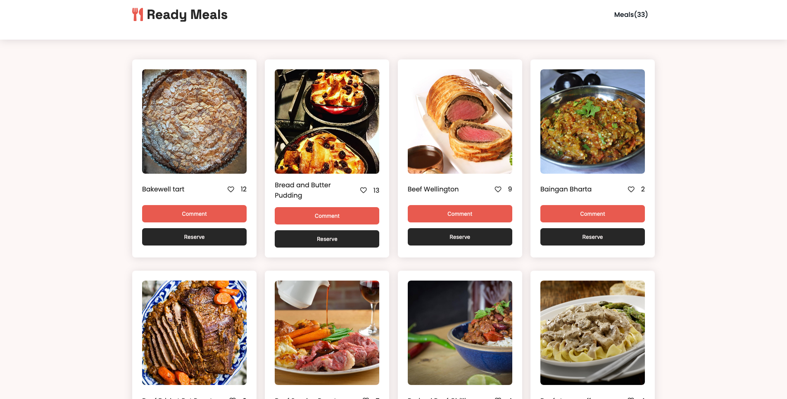

# Javascript Capstone Project

An API based webapp that displays Meals from the [MealsDB](https://www.themealdb.com/api.php) API. The features of this webapp include

- An option to like a meal by clicking on the like button
- A comment button that opens up a modal and allows users to leave comments
- A reservation button that also opens a modal and allows users to make reservations



**Additional description about the project and its features.**

## ⚒️ Built With

`Languages`

- HTML
- CSS
- Javascript

`Frameworks`

- Webpack

## 📡 Live Demo

[Link to Live Demo](https://yaseerokino.github.io/javascript-capstone/)

## 🎥 Video Link

[Link to Project Video Description](https://www.loom.com/share/3ba7b7be5da24625a037048aca2062f5)

## 🧰 Tools

The following tools help make it easier to run this code.

- [Visual Studio Code](https://code.visualstudio.com/): A source code editor
- [git](https://git-scm.com/downloads): A tool for managing source code

## 🔥 Getting Started

### **Prerequisites**

To run this project you need [Node](https://nodejs.org/en/) and [NPM](https://docs.npmjs.com/about-npm-versions) installed on your local machine
<br>
`Note` : When you install Node.js, npm is automatically installed, However, npm is released more frequently than Node.js

### **Setup**

If you have installed git you can clone the code to your machine, or download a ZIP of all the files directly.
[Download the ZIP from this location](https://github.com/yaseerokino/javascript-capstone/archive/refs/heads/develop.zip), or run the following [git](https://git-scm.com/downloads) command to clone the files to your machine:

```bash
git clone https://github.com/yaseerokino/javascript-capstone.git
```

### **Install**

Once the files are downloaded or cloned on your machine, open your terminal and `cd to "javascript-capstone" folder` and run the following commands:

**To install all dependencies**

```bash
npm install
```

**To build and configure webpack**

```bash
npm run build
```

**To start development server**

```bash
npm run start
```

### **Test**

Once all the dependencies have been installed and webpack has been built and configured successfully run the following commands:

```bash
npm test
```

## 🙎🏾‍♂️ Authors

### Yaseer Okino

- GitHub: [@yaseerokino](https://github.com/yaseerokino)
- Twitter: [@yaseerokino](https://twitter.com/yaseerokino)
- LinkedIn: [Yaseer Okino](https://linkedin.com/in/yaseerokino)

### Kossi

- GitHub: [@kossi-stack](https://github.com/Kossi-stack/)
- Twitter: [@Kossi-stack](https://twitter.com/SoloJean5)
- LinkedIn: [Kossi Stack](https://www.linkedin.com/in/kossifioklou2406/)

### Lilian Moraa

- GitHub: [@lily-coder](https://github.com/lily-coder/)
- LinkedIn: [Lilian Moraa](https://www.linkedin.com/in/lilian-moraa-99950b1b8/)

## 👊🏾 Show your support

Give a ⭐️ if you like this project!

## 📝 License

This project is [MIT](./LICENSE) licensed.
